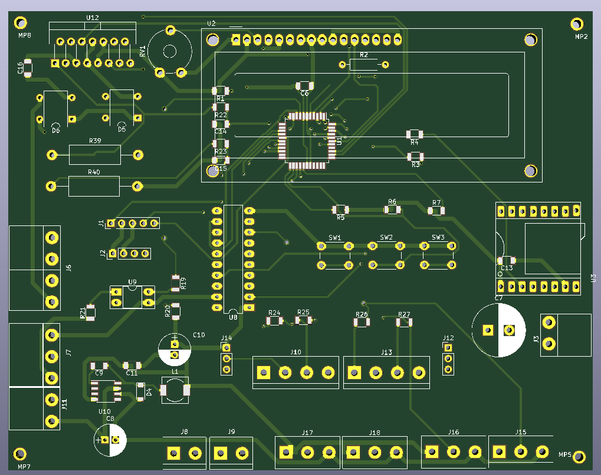
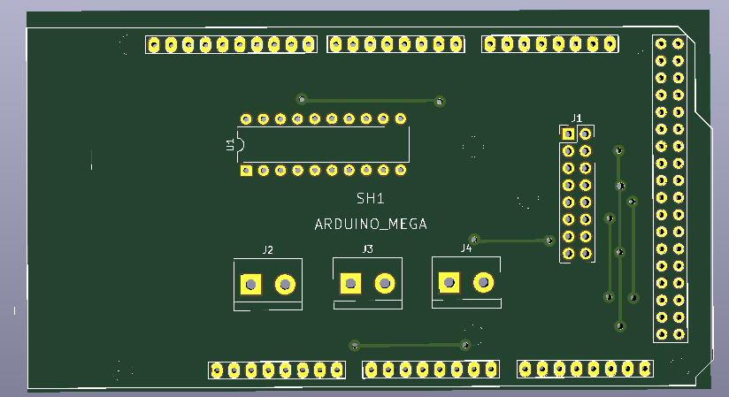

<h1 align="center">Hızlı Pedallı/Bike Car Racing Game Machine</h1>
<p  align="center">
    
</p>

## Contents
- [Overview](#Overview)
- [How it works?](#How-it-works)
- [Used technologies](#Used-technologies)

## Overview

This game machine can be played by two people or alone. While playing as a single player, the player competes with the system. In a two-player game, players compete with each other. Two toy cars move on the track in proportion to the speed of the bicycles associated with them. Instant average speed, distance travelled, number of laps and game time are displayed on RGB LED panel displays. The player with the most distance at the end of the game time wins.

## How it works?

A microcontroller-based motherboard controls the system. To start the game, a contactless card is read into the card reader. The MCU reads the information from two sensors connected to the bicycle wheels, makes the necessary calculations and converts it into speed and route information. Information is sent serially to Arduino Mega. RGB is displayed separately on LED panels. Arduino MEGA was used to drive the RGB LED panels.

<p  align="center">
    
</p

Game duration, amount of coins required for its operation, etc. Settings are made from the LCD on the card. The game is played with game music.

<br>
<p  align="center">
    

</p>

## Used technologies

```bash
- PIC18F45K22 MCU.
- CCS PIC C compiler.
- Speed detect.
- Motor drivers.
- KiCAD PCB design.

```

## Sample working video :

<a href="https://www.youtube.com/watch?v=KFKP7lpa3pI" target="_blank">
     
</a>

- GitHub [@your-ilyas9461](https://github.com/ilyas9461)
- Linkedin [@your-linkedin](https://www.linkedin.com/in/ilyas-yağcioğlu-6a6b17217)

### *** Note : 
Since the circuit is in industrial production, PCB circuit diagrams are not shared.
